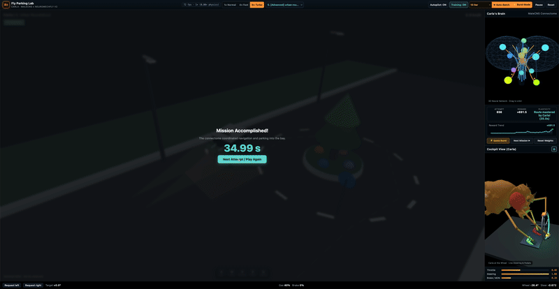
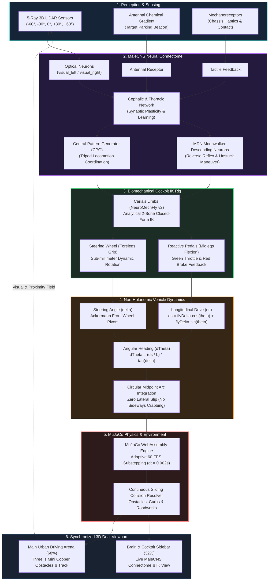

# Fly Parking Lab · NeuroMechFly v2 × MaleCNS

In-browser 3D bio-robotic simulation featuring **Carla**, a fruit fly (_Drosophila melanogaster_) that drives a classic Mini Cooper using the official **NeuroMechFly v2** biomechanical model coupled to the **MaleCNS** neural connectome and the **MuJoCo** rigid-body physics engine executed via WebAssembly.

<p align="center">
  
</p>

---

## System Architecture

The simulation operates as a high-frequency closed-loop cyber-physical system, bridging sensory neurobiology, neural network dynamics, analytical limb inverse kinematics, and non-holonomic vehicle physics:



---

## Getting Started

```bash
# 1. Install dependencies
npm install

# 2. Start development server
npm run dev
```

Open your browser at [http://localhost:5173/](http://localhost:5173/).

---

## Interface Architecture

The experience is divided into a primary driving arena and a synchronized sidebar for telemetry and biomechanical inspection:

### 1. Urban Road Driving Arena (Left Panel — 68%)

- **Vehicle:** Classic Mini Cooper (British Racing Green with white roof) driven by **Carla** from the cockpit.
- **In-Sim HUD Overlays:**
  - Mission identifier with pilot prefix (`Carla | mission_name`).
  - Real-time transmission status (`FORWARD`, `REVERSE`, `PUSHING`).
  - Digital speedometer in `km/h`.
  - Episode counter and elapsed time (`Attempt X · Y.Ys elapsed`).
- **3D Vision Sensors (Lidar / MaleCNS Optical System):**
  - 5 raycasting sensors scanning angles ($[-60^\circ, -30^\circ, 0^\circ, +30^\circ, +60^\circ]$) up to 3.8m.
  - Proximity color coding (cyan = clear, amber = alert, red = danger).
  - Proximity inputs feed descending optical neurons in the connectome (`visual_left`, `visual_right`).

### 2. Synchronized Sidebar (Right Panel — 32%)

- **Carla's Brain (3D MaleCNS Connectome — Top):**
  - Interactive 3D visualization of the cephalic and thoracic neural network.
  - Learning metrics: current attempt, cumulative reward, and synaptic plasticity state.
  - Real-time sparkline graph of the historical reward curve.
  - **Domain Randomization** toggle to evaluate policy generalization under stochastic perturbations.
  - **⚡ Burst Mode** button for headless background simulation without rendering overhead.
- **Cockpit View (Wheel · Pedals · Gear — Bottom):**
  - Elevated 3/4 lateral-frontal perspective showing Carla's entire body (head, compound eyes, thorax, wings, abdomen, and legs).
  - **Upright Steering Wheel:** Gripped by Carla's forelegs, rotating with sub-millimeter precision.
  - **Reactive Racing Pedals:** Lower pedals (red for brake, green for throttle) with mechanical compression, dynamic `pedalLight`, and leg flexion.
  - **Gear Indicator:** Transmission selector (`D` / `R`).

### 3. Lower Telemetry Bar

- Forced manual steering buttons (`Request left` / `Request right`).
- Angular offset toward current waypoint (`Target °`).
- Throttle percentage (`Gas %`) and brake percentage (`Brake %`).
- Steering wheel angle (`Wheel °`) and steer command (`Steer`).

---

## Realistic Urban Mission Catalog

The simulation includes 6 realistic urban driving and parking missions selectable from the top navigation bar:

| #     | Mission                   | Difficulty | Maneuver Type          | Objective & Hazards                                                                                                        |
| :---- | :------------------------ | :--------- | :--------------------- | :------------------------------------------------------------------------------------------------------------------------- |
| **1** | **Parallel Parking**      | Challenge  | `street_parallel`      | Wide avenue maneuver docking into a curb-side slot between two parked vehicles (Coral Mini & Grey Sedan).                  |
| **2** | **Perpendicular Parking** | Technical  | `street_perpendicular` | Commercial lot maneuver executing a sharp 90° turn into a narrow bay between an Urban Pickup and Blue Hatchback.           |
| **3** | **Roadworks Slalom**      | Skill      | `street_slalom`        | High-speed navigation weaving smoothly around 3 reflective highway traffic pylons along a 22m avenue to reach the end bay. |
| **4** | **Alley Loading Bay**     | Expert     | `street_alley`         | Narrow industrial corridor evading a delivery van and dumpster to dock securely into the loading bay.                      |
| **5** | **Urban Roundabout**      | Advanced   | `street_roundabout`    | Continuous curved navigation orbiting a central landscaped rotary island with technical deceleration and exit docking.     |
| **6** | **T-Junction Maneuver**   | Master     | `street_tjunction`     | Complex 3-way intersection negotiating cross-traffic, executing a northern detour, and returning to the parking bay.       |

---

## Vehicle Physics and Ackermann Kinematics

Vehicle movement strictly follows the **non-holonomic bicycle model** with continuous sliding collision resolution:

1. **Pure longitudinal traction:**
   $$ds = \Delta x \cos(\theta) + \Delta y \sin(\theta)$$
   Zero lateral slipping (no sideways diagonal movement or "crabbing").
2. **Static rotation lock:**
   $$d\theta = \frac{ds}{L} \tan(\delta) \quad \text{with } L = 1.45\text{ m}$$
   If the car is stationary ($ds = 0$), chassis yaw cannot rotate ($d\theta \equiv 0$). Front wheels pivot with the steering wheel, but the chassis remains anchored.
3. **Circular arc integration:**
   Position updates across the midpoint arc angle ($x \mathrel{+}= ds \cos(\theta_{mid})$, $y \mathrel{+}= ds \sin(\theta_{mid})$), preventing trajectory discretization errors through tight curves.
4. **Continuous Sliding Collision Resolver:**
   Tangential sliding allows smooth gliding along obstacles, curbs, and boundaries without rigid sticking or clipping.

---

## Repository Structure

```
web3d/
├── public/
│   └── nmf/
│       ├── game/
│       │   ├── game.html             # High-performance HUD, telemetry & dual viewports
│       │   ├── game.js               # Biomechanical loop, MuJoCo WASM, Three.js & IK
│       │   └── autopilot.mjs         # Non-holonomic planner, missions & collision math
│       ├── models/                   # NeuroMechFly v2 meshes, fly kinematics & textures
│       ├── connectome/               # MaleCNS v1.0 neural graph & synaptic weight data
│       └── wasm/                     # MuJoCo physics engine compiled to WebAssembly
├── src/                              # React / Next.js web application wrapper
├── tests/                            # Comprehensive Node.js unit & integration tests
│   └── parking-autopilot.test.mjs    # 26 automated unit & mission tests
├── scripts/                          # CI & integrity audit suite
│   └── check-integrity.mjs           # 5 invariant guards (kinematics, HUD, viewports)
├── package.json                      # Build scripts, toolchain & dependencies
└── README.md                         # Technical documentation, architecture & guide
```

---

## Integrity Guards and Verification

The project includes strict automated tests and invariant audits to guard against regressions in physics, camera framing, or UI telemetry:

```bash
# Run unit test suite (26 passing tests)
npm test

# Run code, physics, and invariant integrity checks directly
node scripts/check-integrity.mjs

# Run full project verification (lint, format, test, integrity)
npm run check

# Verify production build
npm run build
```

---

## Manual Controls

Toggle between autonomy and manual keyboard control with the `Autopilot: ON/OFF` button:

| Key             | Action                                                                                |
| :-------------- | :------------------------------------------------------------------------------------ |
| `W`             | Accelerate / Drive forward                                                            |
| `S`             | Reverse / Brake                                                                       |
| `A`             | Steer left                                                                            |
| `D`             | Steer right                                                                           |
| `Q`             | Emergency stop / Brake                                                                |
| `Space`         | Restart current attempt / Pause                                                       |
| `+` / `-` / `t` | Increase, decrease, or cycle simulation speed (1× Normal, 4× Fast, 8× Turbo, 16× Max) |

---

## License and Provenance

- Built on the official **NeuroMechFly v2** biomechanical models and **MaleCNS v1.0** connectome reconstructions.
- NeuroMechFly license available in `public/nmf/LICENSE-NeuroMechFly.txt`.
